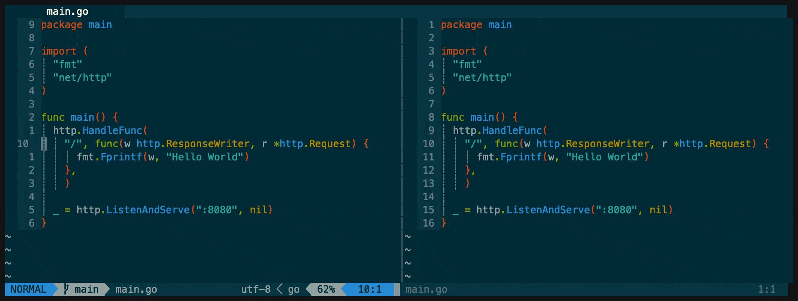

# toggle-relativenumber.nvim



Automatically turns off relativenumber when leaving a buffer, and enables it when entering a buffer.

Inspired by [jeffkreeftmeijer/vim-numbertoggle](https://github.com/jeffkreeftmeijer/vim-numbertoggle), written in Lua for Neovim.

## Installation

### Packer

```
use { 'joshdirkx/toggle-relativenumber.nvim' }
```
